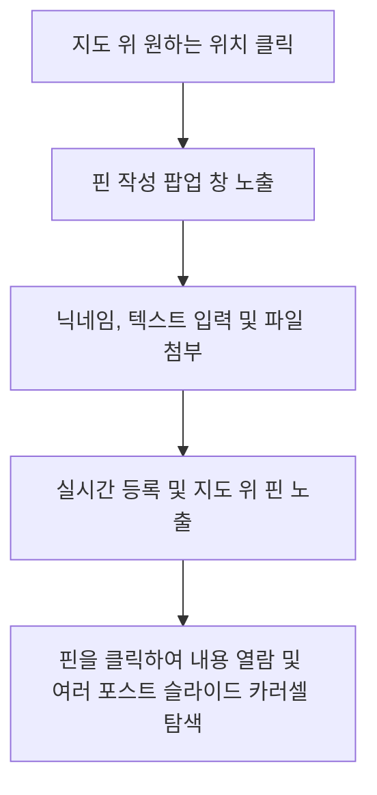
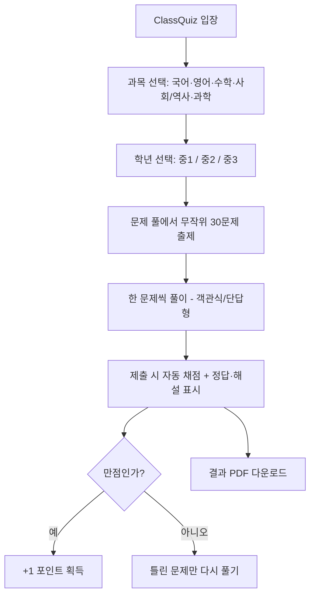

# 🏫 Classroom Collaboration Platform 사용자 메뉴얼

**실시간 교실 협업 플랫폼**에 오신 것을 환영합니다! 이 플랫폼은 교사와 학생이 실시간으로 의견을 나누고, 지도를 활용하며, 함께 그림을 그리고, 퀴즈를 풀 수 있는 풍부한 상호작용 도구입니다.

이 매뉴얼은 처음 사용하는 분들도 **아주 쉽게**, 하지만 **빠지는 기능 없이 100% 활용**하실 수 있도록 꼼꼼하게 작성되었습니다.

---

## 🚀 1. 빠른 시작 (초기 설정 및 접속)

### 💻 1.1 서버 실행하기 (교사/호스트용)
따로 어렵게 Python을 설치하거나 환경 설정을 할 필요가 없습니다! 제공된 파일로 원클릭 실행이 가능합니다.

*   **Windows 사용자**: 
    1. 폴더 내의 **`start_windows.bat`** 파일을 더블클릭합니다.
    2. 필요한 프로그램 환경(포터블 Python 및 라이브러리)을 자동으로 구축하고 서버를 알아서 실행합니다.
*   **macOS / Linux 사용자**: 
    1. 터미널을 열고 **`start_mac.command`** 파일을 실행합니다.

> [!NOTE]  
> 서버가 정상적으로 켜지면 브라우저를 열고 `http://localhost:5555`에 접속하여 플랫폼을 바로 이용할 수 있습니다.

---

### 🌐 1.2 모바일 기기로 학생 접속시키기
이 플랫폼은 **자동 로컬 IP 탐지 기술**이 내장되어 있어, 학생들이 스마트폰이나 태블릿으로 아주 쉽게 접속할 수 있습니다.

1. **교사 PC와 학생 스마트폰(태블릿)이 같은 Wi-Fi 무선 네트워크에 연결되어 있는지 확인합니다.**
2. 서버가 켜질 때 표시되는 **로컬 IP 주소**(예: `http://192.168.0.X:5555`)를 학생들에게 알려주거나 해당 주소로 연결되는 QR 코드를 생성해 칠판에 띄워줍니다.
3. 학생들은 본인의 기기에서 해당 주소로 접속하면 즉시 실시간 수업에 동참할 수 있습니다.

---

## 🔑 2. 관리자(Admin) 로그인 및 기본 변경

### 2.1 관리자 로그인
*   **접속 경로**: 화면 하단의 `Admin` 버튼을 누르거나, 브라우저 주소창에 `http://localhost:5555/admin/login`을 입력합니다.
*   **기본 비밀번호**: `admin123`

### 2.2 비밀번호 및 데이터 보안 설정
보안을 위해 첫 로그인 후 즉시 비밀번호를 변경해 주세요.
*   **비밀번호 변경**: 관리자 대시보드 👉 **Admin Settings (설정)** 👉 **Change Password (비밀번호 변경)** 메뉴에서 새 비밀번호를 입력하고 저장합니다.

---

## 🎨 3. 4대 실시간 협업 모드 완벽 가이드

플랫폼은 수업 목적에 따라 총 **5가지 모드**를 지원합니다. (협업 3종은 클래스를 만들어 사용하고, ClassQuiz·ClassGame은 포털 카드로 바로 입장합니다.)

### 🗺️ 모드 ① : ClassMap (실시간 지도 상호작용)
세계 지도 또는 특정 캔버스 위에 자유롭게 핀(Flag)을 꽂아 공간과 연관된 의견을 실시간으로 나누는 공간입니다.



*   **핀 꽂기**: 지도에서 원하는 위치를 마우스로 클릭(또는 모바일 화면 터치)하면 핀 작성 창이 열립니다.
*   **멀티 포스트(Carousel) 기능**: 동일한 위치(좌표)에 여러 학생이 핀을 꽂으면, 핀이 겹치지 않고 모달창 내부에서 **'이전(Previous)' / '다음(Next)'** 버튼을 눌러 슬라이드 쇼처럼 한 번에 넘겨볼 수 있습니다.
*   **실시간 연동**: 누군가 핀을 꽂거나 수정/삭제하면 새로고침 없이 즉시 모든 학생의 화면에 업데이트됩니다.

---

### 📝 모드 ② : ClassWrite (실시간 보드/게시판)
공간적인 개념이 필요 없는 자유로운 주제 토론, 아이디어 브레인스토밍, 질문 답변에 최적화된 피드 형태의 게시판입니다.

*   **포스트 작성**: 화면 상단의 작성 칸에 글을 쓰고 파일이나 YouTube 링크를 첨부하여 등록합니다.
*   **공지 및 학습목표 고정**: 교사는 일반 게시글 외에도 **Notice(공지)** 또는 **Learning Objective(학습 목표)** 타입의 글을 쓸 수 있으며, 이는 학생들의 글보다 상단에 고정되어 가독성을 높입니다.

---

### 🖌️ 모드 ③ : ClassDraw (실시간 공동 캔버스)
하나의 화판 위에 교사와 학생들이 동시에 그림을 그리고 지우며 설명할 수 있는 실시간 스케치북입니다.

*   **도구 모음**: 펜 색상 선택(다양한 기본 컬러 제공), 펜 두께 조절(**S**mall, **M**edium, **L**arge), **지우개(Eraser)** 도구가 제공됩니다.
*   **내보내기 (Export)**: 자신이 그린 그림이나 공동 작업을 **PNG 이미지 파일로 즉시 다운로드**하여 간직하거나 제출할 수 있습니다.
*   **전체 지우기 (Clear All - 교사 전용)**: 화면이 너무 복잡해지면 교사는 단 한 번의 클릭으로 캔버스를 깨끗하게 초기화할 수 있습니다.

---

### ❓ 모드 ④ : ClassQuiz (과목별 문제 풀 퀴즈)
**2022 개정 교육과정(중학교)** 에 맞춘 과목별 문제 은행에서, 학생이 스스로 과목과 학년을 골라 문제를 푸는 자기주도 학습 모드입니다. (교사가 매번 문제를 출제하던 기존 방식에서, 미리 준비된 문제 풀을 푸는 방식으로 바뀌었습니다.)



*   **과목·학년 선택**: 5개 과목(국어·영어·수학·사회/역사·과학)과 학년(중1~3)을 고르면, 해당 문제 풀에서 **무작위로 30문제**가 출제됩니다.
*   **자동 채점 + 해설**: 마지막 문제까지 풀고 제출하면 점수, 문항별 정답/오답, **해설**이 한눈에 표시됩니다.
*   **틀린 문제 다시 풀기**: 결과 화면에서 **틀린 문제만 모아 재풀이**할 수 있어 약점 보완에 좋습니다.
*   **결과 PDF 다운로드**: 점수·문항별 정오답·정답이 정리된 **결과지를 PDF로 저장**할 수 있습니다(한글 지원).
*   **포인트 보상**: 한 세트(30문제)에서 **만점(100점)을 받으면 1포인트**가 적립됩니다. 포인트는 기기(브라우저)에 누적되며 과목 선택 화면 상단에서 확인할 수 있습니다.
*   **이름 입력**: 학년 선택 화면에서 이름을 적으면 결과지·포인트에 사용됩니다(로그인 불필요).

> [!NOTE]
> ClassQuiz는 다른 세 모드와 달리 클래스/세션을 따로 만들 필요가 없습니다. 포털의 **ClassQuiz** 카드로 들어가면 바로 과목 선택 화면이 나옵니다.

---

### 🎮 모드 ⑤ : ClassGame (포인트로 즐기는 보상 게임)
ClassQuiz에서 **만점으로 모은 포인트**를 사용해 게임을 즐기는 학습 보상 모드입니다. 학습 동기를 높이는 장치로, 포털의 **ClassGame** 카드로 바로 입장합니다.

*   **게임 목록**: 입장하면 보유 포인트와 즐길 수 있는 게임 목록이 보입니다. 첫 게임으로 디아블로 스타일 액션 RPG **LikeDIA**가 포함되어 있습니다.
*   **포인트로 플레이**: 게임을 고르면 플레이 비용(예: LikeDIA 1포인트)이 표시됩니다. **플레이하기**를 누르면 포인트가 차감되고 게임이 시작됩니다.
*   **포인트가 부족하면**: ClassQuiz에서 한 세트를 만점으로 풀어 포인트를 모은 뒤 다시 도전할 수 있습니다(안내 링크 제공).
*   **포인트 공유**: 포인트는 기기(브라우저) 단위로 누적되며, ClassQuiz와 ClassGame이 같은 포인트를 사용합니다.

> [!NOTE]
> LikeDIA는 별도 설치 없이 플랫폼에 포함된 정적 웹 게임이라, 학생 기기에서도 인터넷 없이 같은 Wi-Fi로 바로 즐길 수 있습니다.

---

## 🧑‍💻 4. 학생(참여자)을 위한 심플 사용법

학생들은 복잡한 회원가입이나 로그인 절차가 전혀 필요 없습니다!

1.  **닉네임 등록**: 클래스에 입장하면 우측 상단 닉네임 칸에 본인의 이름을 적습니다.
2.  **글/의견 작성**:
    *   원하는 내용을 자유롭게 타이핑합니다. **마크다운(Markdown)** 문법을 지원하므로 `# 제목`, `**굵게**`, `- 리스트` 등을 이용해 풍부하게 글을 꾸밀 수 있습니다.
3.  **다양한 첨부파일 지원**:
    *   글 작성 시 이미지(`PNG`, `JPG`, `GIF`), 동영상(`MP4`, `WEBM`, `MOV`), 문서 파일(`PDF`, `TXT`, `DOCX`, `HTML`) 등을 제한 없이 첨부할 수 있습니다.
    *   **실시간 미리보기(Live Preview)**가 지원되어 파일을 선택하거나 텍스트를 치는 순간 아래쪽에 어떻게 포스트가 보일지 미리 확인 가능합니다.
4.  **YouTube 동영상 자동 임베드**:
    *   YouTube 동영상 주소(URL)를 복사해서 글 속에 넣으면, 알아서 주소를 감지해 **글 안에 YouTube 동영상 플레이어**를 예쁘게 만들어 줍니다.
5.  **수정 및 삭제 권한**:
    *   자신이 쓴 포스트는 브라우저를 끄지 않는 한, 언제든 **Edit(수정)** 및 **Delete(삭제)** 버튼을 눌러 고치거나 지울 수 있습니다. (다른 학생의 글은 지울 수 없습니다.)

---

## 👩‍🏫 5. 교사(관리자)를 위한 마스터 클래스 가이드

교사(관리자)는 일반 참여자보다 훨씬 강력하고 편리한 학급 제어 기능을 활용할 수 있습니다.

### 📁 5.1 클래스(Class) 및 세션(Session) 라이프사이클 관리
*   **클래스 개설**: 대시보드에서 클래스 이름과 모드(ClassMap / ClassWrite / ClassDraw 등)를 설정하여 새 학급을 만듭니다.
*   **세션 추가**: 하나의 클래스 안에는 여러 개의 세션(예: 1차시, 2차시, 조별 활동 등)을 자유롭게 만들 수 있어 데이터를 주차별/주제별로 격리 관리할 수 있습니다.
*   **비활성화 (Close)**: 수업이 끝나면 클래스나 세션을 **Close** 처리합니다. 비활성화된 클래스는 학생들의 접근이 즉시 차단되며, 오직 로그인한 교사만 대시보드에서 과거 아카이브용으로 열람할 수 있습니다.

---

### 📊 5.2 ClassQuiz 문제 풀 관리 (/admin/quiz)
ClassQuiz는 과목·학년별 **문제 은행(Pool)** 으로 운영됩니다. 관리자는 보유 문항 수를 확인하고 엑셀로 문제를 일괄 추가할 수 있습니다.

*   **접속 경로**: 관리자로 로그인한 뒤 포털의 **ClassQuiz** 카드를 누르면 문제 풀 관리 화면(`/admin/quiz`)이 열립니다.
*   **현황 보기**: 5과목 × 중1~3 표에서 셀마다 보유 문항 수가 표시됩니다. 한 세트는 30문제이므로 **30문제 이상** 있어야 정상 출제됩니다.

```
📂 [ 문제 풀 엑셀 열 구조 (첫 행은 헤더) ]
unit (단원) | standard_code (성취기준) | difficulty (난이도 1~3) | q_type (choice/short) | question (질문) | options(|) (보기, | 구분) | correct_answer (정답) | explanation (해설)
```

1.  **엑셀로 가져오기 (↑ 버튼)**:
    *   해당 과목·학년 셀의 **↑** 버튼을 누르고 위 형식의 `.xlsx` 파일을 선택합니다.
    *   **q_type**: 객관식은 `choice`, 단답형은 `short`.
    *   **options**: 객관식일 때만 보기를 `사과|바나나|오렌지`처럼 파이프(`|`)로 구분합니다.
    *   **correct_answer**: 객관식은 정답 보기 **번호**(예: `2`), 단답형은 정답 텍스트(여러 개면 `정답1|정답2`).
    *   업로드 시 **해당 과목·학년의 기존 문제를 모두 교체**하므로, 먼저 ↓로 내려받아 편집 후 올리는 것을 권장합니다.
2.  **엑셀로 내보내기 (↓ 버튼)**:
    *   해당 셀의 문제 목록을 `.xlsx`로 내려받아 보관하거나 수정할 수 있습니다.

> [!TIP]
> 코드로 대량 관리하려면 `app/seed_data/<과목>_<학년>.json`에 문제를 추가한 뒤 `python seed_questions.py <과목>` 으로 적재합니다. 자동 생성 문제(수학·영어 + 국어·사회·과학 용어 문제)는 `python generate_questions.py` 로 채웁니다. 용어 사전은 `app/quiz_knowledge.py`, 수학·영어 생성기는 `app/quiz_generators.py`에 있습니다.

---

### 📝 5.3 소중한 수업 결과물 Markdown 일괄 다운로드 (Export Markdown)
학기가 끝난 후 학생들의 포트폴리오를 평가하거나 수행평가 자료로 백업할 때 활용하기 매우 좋은 핵심 기능입니다.

*   관리자 대시보드 👉 **Export Markdown** 버튼을 누릅니다.
*   **작동 방식**: 서버에 기록된 모든 클래스, 세션별 학생들의 게시글과 첨부파일 메타데이터를 파싱하여 **구조화된 마크다운 문서(`.md`)들이 주소/세션별로 정렬된 ZIP 압축파일** 형태로 즉시 다운로드됩니다.
*   각 포스트 문서에는 작성 시간, 작성한 학생 닉네임, 지도 상의 좌표(위경도), 첨부파일 경로가 완벽히 보관되어 추후 채점 및 관리에 매우 유용합니다.

---

### 🧹 5.4 안전 데이터 전체 초기화 (Reset Data)
새로운 학기, 혹은 새로운 학년도가 시작되어 기존의 모든 학생 데이터와 업로드된 미디어 파일들을 한 번에 비우고 싶을 때 사용합니다.

*   관리자 대시보드 👉 **Admin Settings** 👉 **Reset Data (데이터 초기화)** 버튼을 누릅니다.
*   **주의**: 이 작업을 수행하면 데이터베이스 내의 모든 클래스, 세션, 게시글, 학생 답안이 완전 삭제되며, 서버의 `uploads` 폴더 내에 저장된 모든 이미지/비디오 파일도 자동으로 깔끔하게 삭제되어 서버 용량을 확보해 줍니다. 
*   ⚠️ **초기화 전에 꼭 필요한 데이터는 'Export Markdown'으로 백업받았는지 꼭 더블 체크해 주세요!**

---

## 💬 6. 자주 묻는 질문 (FAQ)

> **Q. 학생들이 모바일로 접속하려고 하는데 페이지를 찾을 수 없다고 뜹니다.**
> 
> **A.** 아주 대표적인 네트워크 설정 문제이며, 다음 두 가지만 확인하시면 즉시 해결됩니다:
> 1. 교사 PC와 학생의 기기가 **동일한 와이파이(Wi-Fi)**를 사용하고 있는지 확인해 주세요. 통신사 LTE/5G망으로 접속하면 로컬 IP 주소로 들어올 수 없습니다.
> 2. 교사 PC의 Windows 방화벽 설정에서 Python 또는 Flask 포트(`5555`)의 인바운드 연결 허용이 차단되어 있을 수 있습니다. 서버 첫 실행 시 방화벽 경고창이 뜨면 반드시 **'네트워크 액세스 허용'**을 눌러주셔야 합니다.

> **Q. 업로드할 수 있는 파일 포맷의 종류는 제한되어 있나요?**
> 
> **A.** 본 플랫폼은 교실 내 다양한 콘텐츠 공유를 위해 매우 넉넉한 포맷을 지원합니다.
> *   **이미지**: `png`, `jpg`, `jpeg`, `gif` (업로드 시 실시간 모달 미리보기를 위한 썸네일이 자동 생성됩니다.)
> *   **동영상**: `mp4`, `webm`, `mov` (인라인 비디오 재생기 지원)
> *   **문서 및 기타**: `pdf`, `txt`, `docx` (Word 파일), `html`, `htm` (웹페이지 파일)

> **Q. 학생들이 닉네임을 변경할 수 있나요?**
> 
> **A.** 네! 화면 우측 상단의 Name 입력칸에 언제든지 새로운 이름을 기입하면 실시간으로 반영되어 다음 쓰는 글부터 바뀐 닉네임으로 저장됩니다.

---

이 메뉴얼과 함께 더욱 활기차고 인터랙티브한 멋진 실시간 스마트 교실을 만들어 보세요! 🎓✨
